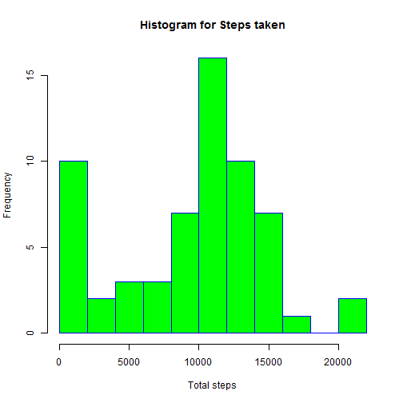

# Assignment 1 Reproducible Research  

Global options

```r
library(knitr)
opts_chunk$set(echo = TRUE)
```

##Loading and preprocessing the data  

```r
options(scipen = 999) ## prevent exponiential notation in output
data <- read.csv("activity.csv", header = T, sep = ",")  
```

##What is the mean total number of steps taken per day?
Lets understand the mean total of the steps taken per day. Ignore missing values.  

```r
total.per.day <- tapply(data$steps, data$date, sum, na.rm = TRUE)  
```

A histgram will help us understand the trend better  

```r
hist(total.per.day,     main="Histogram for Steps taken",     xlab="Total steps", border="blue",     col="green" , breaks = 10)  
```



Finding out the mean and median of the total number of steps taken per day

```r
mean.total.per.day <- round(mean(total.per.day))
median.total.per.day <- round(median(total.per.day))
```

The rounded values of mean is 9354 and the median is 10395.

##What is the average daily pattern?
Taking a look at the average daily pattern

```r
intervals.day <- tapply(data$steps, data$interval, mean, na.rm=T)
plot(intervals.day ~ unique(data$interval), type="l", xlab = "five minute interval", ylab = "mean of steps")
```


Lets see which one is the most active interval of the day

```r
max.pos<- names(intervals.day[which.max(intervals.day)])
```

most active interval of the day is 835.

##Imputing missing values

```r
missing.rows <- nrow(data[!complete.cases(data),])
```

Number of missing rows are 2304. 

Replace missing values with mean for intervals

```r
data2 <- data  
for (i in 1:nrow(data)){
       if(is.na(data$steps[i])){
              data2$steps[i]<- intervals.day[[as.character(data[i, "interval"])]]
       }
}
```
A new histogram with recalculated values will help us understand the trend better

```r
total.per.day2 <- tapply(data2$steps, data2$date, sum, na.rm = TRUE)

hist(total.per.day2,     main="Histogram 2 for Steps taken",     xlab="Total steps", border="blue",     col="green" , breaks = 10)
```


Finding out the mean and median of the total number of steps taken per day with the new data frame without Missing values

```r
mean.total.per.day2 <- round(mean(total.per.day2))
median.total.per.day2 <- round(median(total.per.day2))
```
The new rounded values --> mean is 10766 and the median is 10766.
The old rounded values were--> mean is 9354 and the median is 10395. mean and median have increased. 

##Are there any differences in activity patterns between weekdays and weekends
Create a new column with day type

```r
data2$date <- as.Date(data2$date)
#create a vector of weekdays
weekdays1 <- c('Monday', 'Tuesday', 'Wednesday', 'Thursday', 'Friday')
#convert to factors
data2$wDay <- factor((weekdays(data2$date) %in% weekdays1), 
                     levels=c(FALSE, TRUE), labels=c('weekend', 'weekday'))
```

Plot the weekday Vs weekend plot

```r
library(lattice)
plot.data <- aggregate(data2$steps, 
                       by=list(data2$wDay, data2$interval), mean)
names(plot.data) <- c("weekday", "interval", "mean")
xyplot(mean ~ interval |weekday, plot.data, 
       type="l", 
       lwd=1, 
       xlab="Interval", 
       ylab="Number of steps", 
       layout=c(1,2))
```


